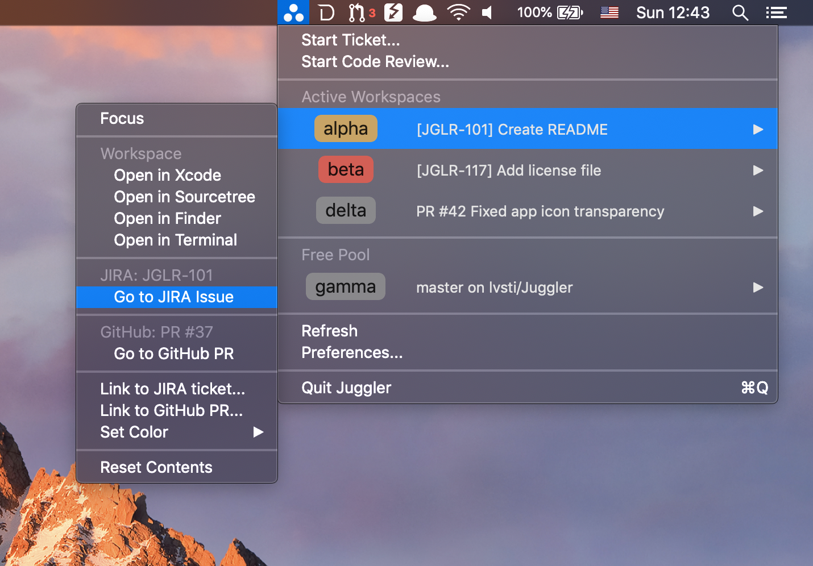
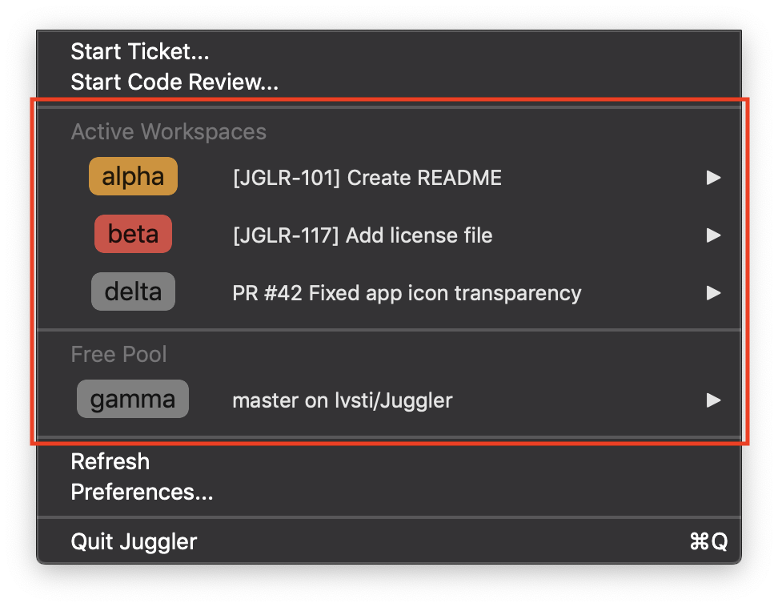
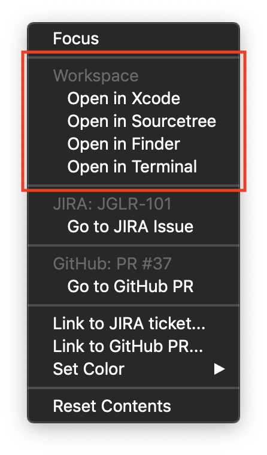
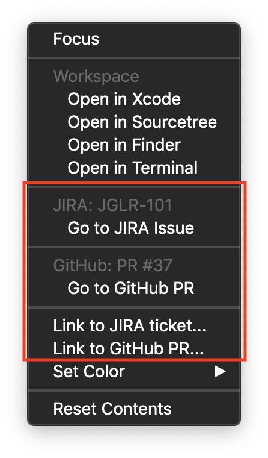

#  Juggler

Juggler is a macOS status bar app that aims to reduce the friction incurred by frequent context switches in an Xcode-GitHub-JIRA workflow.

### Use case

In my day job, we are using JIRA to track issues and integrate our code on GitHub. There are basically two things one can be doing at any given moment:

1. working on an issue in an own branch
2. reviewing someone else's PR

Since these tasks not only can highly overlap but get blocked/unblocked arbitrarily, I found it tedious to continuously switch branches on a single working copy whenever I move on to the next task/review. So I have many of them&mdash; but it's hard to remember which one belonged to which task. This is what Juggler tries to solve.

### How it works

Juggler herds a bunch of git working copy folders (called "workspaces") by storing additional metadata (issue, PR number etc.) with them. Currently, these folders are discovered within a user-defined workspace root folder. The app then reads the working copy status and determines the available actions for any given workspace.

Workspaces can be either assigned to a task or available (if not on any branch). Juggler lists the two groups separately:

For each workspace, there are easy access shortcuts for the Xcode project, opening the working copy with a GUI git client (Sourcetree), and revealing the folder in Finder or in your favourite Terminal app.

You can also link a JIRA ticket or a GitHub PR to the workspace, which, apart from setting a user-friendly title for the workspace, allows for quickly navigating to the issue or PR web page.

To further simplify the setup phase for a given task, Juggler offers the following workflow-based setup sequences:

- **Start Ticket** (providing a valid issue number)

    1. working copy is reset to master, origin is pulled
    2. a new branch is created off master, appropriately named using the issue number and title (e.g. `ABC-123-fix-crash-in-appdelegate`)

- **Start Code Review** (providing a valid PR number) 

    1. working copy is reset to master, origin is pulled
    2. PR branch is checked out
    3. working copy is reset to branching point in mixed mode (all changes appear as uncommitted)

Both sequences work on the first available workspace.

### Requirements

Xcode 10.2.1, Swift 4.2, OSX 10.13
